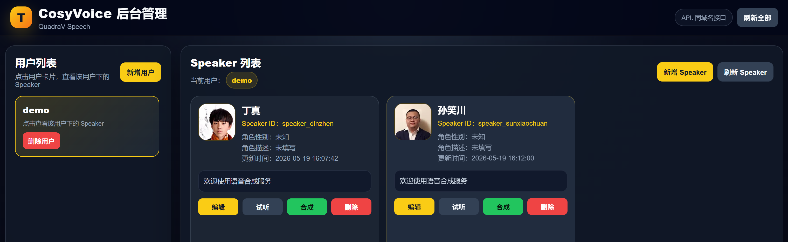
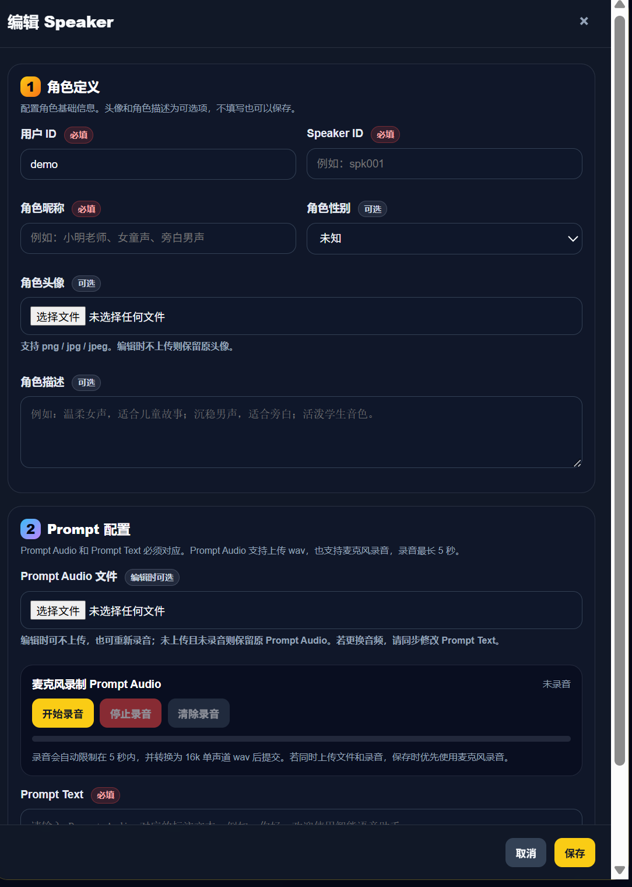
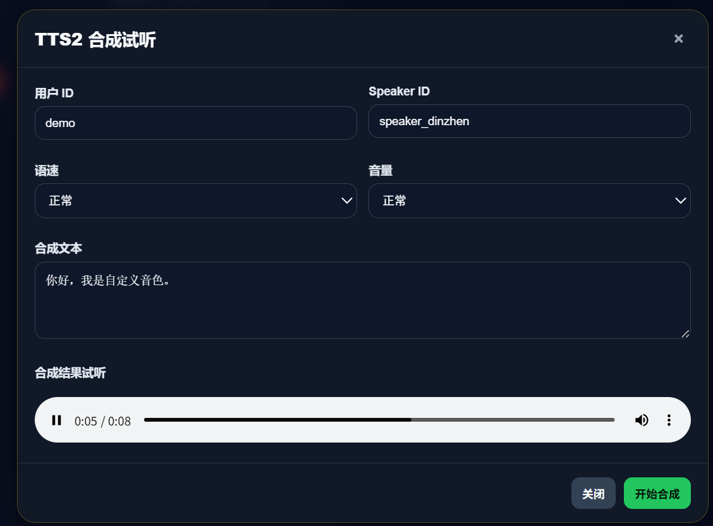

# 🎙️ CosyVoiceUI - CosyVoice TTS 管理后台

<div align="center">

## 🚀 基于 Triton Inference Server 的高性能 CosyVoice TTS 管理平台

支持：
✨ 多用户音色管理
✨ Web 后台实时试听
✨ 麦克风录制 Prompt
✨ HTTP API 调用
✨ Triton 高并发推理
✨ Docker 一键部署

<br>

[]()
[]()
[]()
[]()
[]()

</div>

---

# 📌 项目简介

CosyVoiceUI 是基于：

* [CosyVoice 官方项目](https://github.com/FunAudioLLM/CosyVoice?utm_source=chatgpt.com)
* NVIDIA Triton Inference Server
* FastAPI
* Web UI

构建的一套：

> 🎯 企业级 TTS 音色管理 + 在线语音合成平台

支持：

* 多用户音色管理
* Prompt 音频上传
* Prompt 麦克风录制
* 实时 TTS 合成试听
* 高并发 HTTP 推理服务
* Triton GPU 推理部署

---

# ✨ 功能特性

## 🎧 音色管理

* 支持 userId 隔离
* 支持 speakerId 注册
* 支持音色增删改查
* Prompt 音频持久化存储

---

## 🎙️ Prompt 音频录制

支持：

* 📁 文件上传
* 🎤 浏览器 Mic 录制
* WAV 自动转换
* 16k PCM 标准化

---

## ⚡ 高性能推理

基于 Triton Inference Server：

* GPU 推理
* 动态 Batch
* 高并发
* HTTP/gRPC 服务
* TensorRT-LLM 加速

---

## 🌐 Web UI

提供：

* 在线管理后台
* 实时试听
* 音色测试
* 音色配置
* 用户管理

---

# 🏗️ 项目架构

```text
                +----------------------+
                |      Web UI          |
                |   FastAPI Backend    |
                +----------+-----------+
                           |
                           v
                +----------------------+
                |   CosyVoice HTTP     |
                |      Server API      |
                +----------+-----------+
                           |
                           v
                +----------------------+
                | Triton InferenceSrv  |
                | TensorRT-LLM Engine  |
                +----------+-----------+
                           |
                           v
                +----------------------+
                |      CosyVoice       |
                +----------------------+
```

---

# 📦 1. 安装

# 🚀 安装 CosyVoice Triton Server

官方文档：

👉 [CosyVoice Triton 部署文档](https://github.com/FunAudioLLM/CosyVoice/blob/main/runtime/triton_trtllm/README.md?utm_source=chatgpt.com)

---

## 一键安装脚本

```bash
# 安装 cosyvoice docker 环境
bash launch_cosvyvoice_triton_server install

# 启动 triton 服务
bash launch_cosvyvoice_triton_server start

# 停止 triton 服务
bash launch_cosvyvoice_triton_server stop

# 查看日志
bash launch_cosvyvoice_triton_server logs

# 查看状态
bash launch_cosvyvoice_triton_server status
```

---

## 验证 Triton 服务

```bash
python3 -m CosyVoiceUI.backend
```

---

# 🧩 安装 CosyVoiceUI

```bash
conda create -n cosyvoiceui python=3.10

conda activate cosyvoiceui

pip install -r requirements.txt
```

---

# 🌐 2. 启动后台 UI

```bash
python3 -m CosyVoiceUI.server
```

默认端口：

```text
10010
```

配置文件：

```text
CosyVoiceUI.config
```

---

# 🖥️ 进入后台

服务启动后：

```text
https://$host:$port/
```

即可进入后台配置音色。

---

# 📸 后台预览

## 🎛️ 主后台

支持：

* 用户管理
* 音色管理
* 实时试听



---

## 🎤 注册音色

支持：

* Prompt 上传
* Mic 录制
* speakerId 配置



---

## 🔊 合成测试

支持：

* 文本实时合成
* 在线试听
* 参数调整



---

# 🧠 3. API 调用

在后台中注册：

* `userId`
* `speakerId`

后，即可通过 HTTP API 调用 TTS 服务。

---

# 📮 HTTP API

## 接口地址

```text
POST /tts2/
```

---

## 请求参数

| 参数        | 类型     | 必填 | 默认值      | 说明    |
| --------- | ------ | -- | -------- | ----- |
| text      | string | ✅  | -        | 合成文本  |
| language  | string | ❌  | zh       | 语言    |
| speed     | enum   | ❌  | balanced | 语速    |
| volume    | enum   | ❌  | middle   | 音量    |
| userId    | string | ✅  | -        | 用户ID  |
| speakerId | string | ✅  | -        | 说话人ID |

---

## speed 可选值

```text
low
balanced
fast
```

---

## volume 可选值

```text
small
middle
large
```

---

# 💡 Curl 调用示例

```bash
curl -X POST "http://localhost:10100/tts2/" \
     -F "text=你好，这是一个测试。nice to meet you!" \
     -F "userId=common" \
     -F "speakerId=speaker_2" \
     -F "speed=balanced" \
     -F "volume=middle" \
     --output tts_output_custom.mp3
```

---

# 🐍 Python 调用示例

```python
import requests

url = "http://localhost:10100/tts2/"

files = {
    "text": (None, "你好，这是一个测试"),
    "userId": (None, "common"),
    "speakerId": (None, "speaker_2"),
    "speed": (None, "balanced"),
    "volume": (None, "middle"),
}

response = requests.post(url, files=files)

with open("output.mp3", "wb") as f:
    f.write(response.content)

print("done")
```

---

# ⚙️ 推荐服务器配置

| 配置     | 推荐             |
| ------ | -------------- |
| GPU    | RTX3090 / A100 |
| CUDA   | 12.x           |
| Python | 3.10           |
| Docker | >= 24          |
| 显存     | >= 24GB        |

---

# 📁 项目目录

```text
CosyVoiceUI/
├── backend/
├── static/
├── templates/
├── config.py
├── server.py
├── requirements.txt
└── launch_cosvyvoice_triton_server
```

---

# 🔥 TODO

* [ ] WebSocket 流式 TTS
* [ ] 多 GPU 调度
* [ ] 音色市场
* [ ] 音色导入导出
* [ ] OpenAI 风格 API
* [ ] 批量合成
* [ ] 音频缓存加速

---

# ❤️ 致谢

感谢：

* [FunAudioLLM / CosyVoice](https://github.com/FunAudioLLM/CosyVoice?utm_source=chatgpt.com)
* NVIDIA Triton
* TensorRT-LLM
* FastAPI

---

# 📬 联系作者

📧 邮箱：

```text
605686962@qq.com
```

---

<div align="center">

# ⭐ 如果这个项目对你有帮助，欢迎 Star ⭐

</div>
